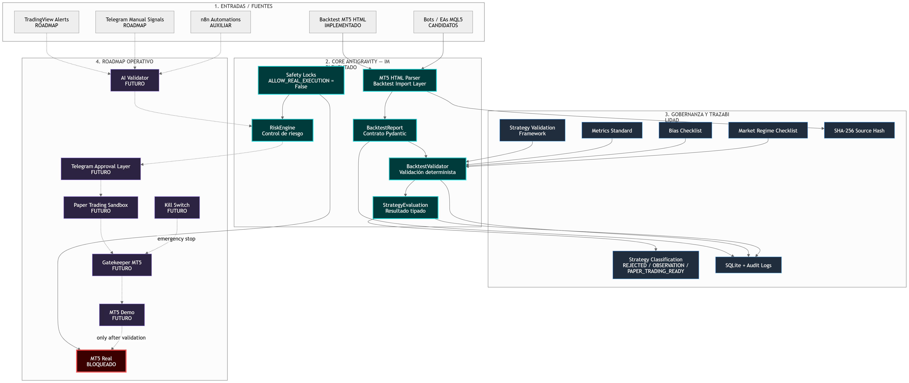

# Proyecto Antigravity 🚀

## Desarrollo asistido con Google Antigravity

Este proyecto se está desarrollando con ayuda de Google Antigravity como entorno de asistencia, planificación, implementación controlada y validación técnica.

## 🏫 Proyecto Académico de Trading Algorítmico

**Antigravity** es un sistema académico de trading algorítmico asistido por IA, desarrollado como proyecto de fin de curso. El proyecto demuestra habilidades en diseño de arquitecturas de software, integración de APIs, seguridad financiera y sistemas de evaluación de riesgo.

> ⚠️ **AVISO IMPORTANTE**: Este proyecto **NO ejecuta operaciones reales** en mercados financieros. Todos los mecanismos de seguridad están configurados para bloquear la ejecución real de manera definitiva.

---

## 📚 Objetivo Académico

Este proyecto fue desarrollado para demostrar:

1. **Arquitectura de Software**: Diseño de sistemas distribuidos con FastAPI
2. **Seguridad Financiera**: Motor de evaluación de riesgo con reglas deterministas y de validación estricta
3. **Integración de Sistemas**: API REST, procesamiento de informes históricos, bases de datos SQLite y validación de configuraciones
4. **Desarrollo Seguro**: Variables de entorno, gestión de secretos y control de versiones mediante .gitignore

## 🧱 Arquitectura: Bot + Agente IA + Ecosistema

El proyecto Antigravity se concibe como un ecosistema integral de trading algorítmico estructurado en tres componentes:

- **Bot Algorítmico**: Receptor y enrutador de señales técnicas basadas en indicadores (e.g., TradingView vía webhooks y orquestación con n8n). En esta fase académica, actúa como el emisor de los intentos de operación (`TradeIntent`).
- **Agente IA**: Componente en fase de diseño/roadmap que utilizará LLMs locales (como Ollama) para la validación contextual de operaciones, análisis cualitativo y generación de explicaciones de mercado.
- **Ecosistema**: El núcleo base desarrollado en FastAPI, el motor determinista **RiskEngine** que aplica reglas de seguridad estrictas de forma local, el framework de validación de estrategias y backtests, y la base de datos **SQLite** para persistir la bitácora de auditoría.

### Diagrama de Arquitectura Maestro

A continuación se presenta la arquitectura conceptual y técnica detallada del ecosistema:



---

## 🎯 Estado Actual (Fase 4.1)

El proyecto ha completado con éxito la **Fase 4.1: Backtest Import Layer**, incorporando capacidades robustas de ingesta, normalización, trazabilidad e inspección de reportes de rendimiento histórico exportados desde MetaTrader 5 (MT5).

### Tabla de Componentes del Sistema

| Componente / Módulo | Estado | Descripción / Cobertura |
| :--- | :--- | :--- |
| **FastAPI Core** | ✅ Implementado | Servidor API web base, endpoints de salud y validación de trades. |
| **SQLite Database** | ✅ Implementado | Persistencia segura del log de auditoría de transacciones y evaluaciones. |
| **Settings & Safety Locks** | ✅ Implementado | Gestión de configuraciones y bloqueos de seguridad estrictos. |
| **RiskEngine Determinista** | ✅ Implementado | Evaluación de 7 reglas de seguridad a nivel de trade (7/7 tests). |
| **Strategy Models Pydantic** | ✅ Implementado | Modelización y tipado estricto de estrategias de trading (8/8 tests). |
| **Strategy Validation Framework** | ✅ Implementado | Framework para el ciclo de vida, versionado y evaluación de estrategias. |
| **BacktestValidator** | ✅ Implementado | Validación formal de consistencia y límites de backtests (10/10 tests). |
| **MT5 HTML Backtest Import Layer** | ✅ Implementado | Capa de importación para reportes de trading de MetaTrader 5. |
| **Parser de informes MT5 HTML** | ✅ Implementado | Extracción exacta de métricas clave de informes en inglés (29/29 tests). |
| **SHA-256 Traceability** | ✅ Implementado | Generación de hashes criptográficos para garantizar la integridad física de los reportes. |
| **Metrics Standard** | ✅ Implementado | Estandarización de métricas de rendimiento (drawdown, ratio Sharpe, profit factor, etc.). |
| **GitHub & Control de versiones** | ✅ Implementado | Repositorio estructurado y políticas de branching establecidas. |
| **Presentación del proyecto** | ✅ Implementado | Material de presentación y diseño de infraestructura en la carpeta `docs/`. |
| **Metrics Engine** | ⏳ Pendiente | Motor de agregación y cálculo en tiempo real de métricas complejas. |
| **AI Validator** | ⏳ Pendiente | Validación contextual cualitativa de estrategias mediante LLMs locales. |
| **Telegram Approval Layer** | ⏳ Pendiente | Canal interactivo de aprobación manual para trades y alertas de validación. |
| **Gatekeeper MT5** | ⏳ Pendiente | Interfaz para acoplamiento de ejecución con terminales MetaTrader 5. |
| **Kill Switch** | ⏳ Pendiente | Botón de pánico y detención inmediata de toda actividad de la API. |
| **Paper Trading Sandbox** | ⏳ Pendiente | Sandbox de simulación y ejecución aislada sin riesgo financiero. |
| **TradingView Integration** | ⏳ Pendiente | Endpoint de webhook y parseo de alertas estructuradas. |
| **n8n auxiliary workflows** | ⏳ Pendiente | Automatización y flujos de soporte externos. |
| **Demo execution** | ⏳ Pendiente | Ejecución de demostración de flujo completo simulado. |
| **Ejecución Real** | 🔒 BLOQUEADA | Bloqueada de forma estricta por diseño y código en todos los entornos. |

---

## 🔄 Flujo Actual de Validación

El flujo de procesamiento implementado hasta la Fase 4.1 sigue un pipeline riguroso para asegurar que solo los backtests íntegros y válidos califiquen para pruebas en cuenta simulada (Paper Trading):

```
MT5 HTML Report (Reporte nativo)
        │
        ▼
   MT5HtmlParser  ───► [Cálculo SHA-256 Traceability] ───► Almacenamiento seguro (Auditoría)
        │
        ▼
   BacktestReport (Modelo estandarizado)
        │
        ▼
  BacktestValidator (Validación de reglas críticas)
        │
        ▼
  StrategyEvaluation (Evaluación global y scoring)
        │
  ┌─────┴────────────────────────────────────────┐
  ▼                                              ▼
[REJECTED / OBSERVATION]             [PAPER_TRADING_READY]
(No cumple criterios mínimos)         (Listo para Sandbox)
```

1. **MT5 HTML Report**: Archivo original HTML exportado de MetaTrader 5.
2. **MT5HtmlParser**: Lee el documento, procesa sus tablas y secciones, calcula el hash SHA-256 de trazabilidad del archivo para evitar alteraciones posteriores y mapea los datos financieros a tipos nativos de Python.
3. **BacktestReport**: Estructura de datos normalizada con tipos de datos e información consistente.
4. **BacktestValidator**: Verifica si el backtest cumple los umbrales de seguridad y métricas aceptables (ej. profit factor mínimo, histórico suficiente de operaciones, pérdidas controladas).
5. **StrategyEvaluation**: Determina el veredicto final de validación académica (`REJECTED`, `OBSERVATION` o `PAPER_TRADING_READY`).

---

## 🔧 Instalación

### 1. Requisitos Previos
- Python 3.10+
- Windows/macOS/Linux

### 2. Clonar el Repositorio
```bash
git clone <repo-url>
cd Proyecto_antigravity
```

### 3. Crear Entorno Virtual (Recomendado)
```powershell
# Windows (PowerShell)
python -m venv .venv
.venv\Scripts\Activate.ps1

# macOS/Linux (Bash/Zsh)
python -m venv .venv
source .venv/bin/activate
```

### 4. Instalar Dependencias
```bash
pip install -r requirements.txt
```

### 5. Configurar Variables de Entorno
```bash
# Copiar el archivo de ejemplo
copy .env.example .env

# NOTA: El archivo .env contiene las configuraciones de seguridad
# NO subir .env al repositorio (ya está en .gitignore)
```

---

## 🚀 Cómo Arrancar FastAPI

### Iniciar el Servidor

Por defecto, el servidor intentará arrancar en el puerto `8000`:
```bash
python -m uvicorn core.main:app --reload
```

> 💡 **Nota de resolución de problemas**: Si el puerto `8000` falla (por ejemplo, debido a conflictos de permisos o colisiones de sockets en Windows con `WinError 10013`), arranca el servidor en el puerto alternativo `8080` ejecutando:
> ```bash
> python -m uvicorn core.main:app --host 127.0.0.1 --port 8080
> ```

### Documentación Automática
- Swagger UI: `http://127.0.0.1:8000/docs` (o `http://127.0.0.1:8080/docs`)
- ReDoc: `http://127.0.0.1:8000/redoc` (o `http://127.0.0.1:8080/redoc`)

### Verificar Estado

Desde otra terminal, puedes comprobar la salud del servicio:
```bash
curl http://127.0.0.1:8000/health
```
*(O si usas el puerto alternativo `8080`):*
```bash
curl http://127.0.0.1:8080/health
```

Debería devolver:
```json
{
  "status": "ok",
  "service": "antigravity_core",
  "security_locks": {
    "environment": "development",
    "real_execution_allowed": false,
    "approval_required": true
  }
}
```

---

## 🧪 Ejecutar Tests

El proyecto cuenta con una batería global de **47 tests unitarios y de integración** con un resultado consolidado de **0 fallos**.

Para ejecutar la batería completa de tests usando `pytest`:

```bash
pytest
```

### Cobertura del Set de Pruebas

- **RiskEngine**: **7/7** tests que validan estrictamente las políticas de riesgo deterministas.
- **Strategy Models & Pydantic**: **8/8** tests que garantizan la integridad de la entrada de datos de estrategia.
- **BacktestValidator**: **10/10** tests que verifican las reglas de aceptación y consistencia de los backtests.
- **MT5 HTML Parser & Import Layer**: **29/29** tests que garantizan el parseo robusto e integridad de reportes de MetaTrader 5.

**Comando de ejecución:**
```bash
pytest -v
```

---

## 📁 Estructura del Proyecto

```
Proyecto_antigravity/
├── .env                    # ⚠️ NO subir a Git (secretos)
├── .env.example           # ✅ Plantilla segura
├── .gitignore             # ✅ Configurado
├── core/                  # ✅ Núcleo del sistema
│   ├── main.py           # FastAPI app
│   ├── risk_engine.py    # Motor de riesgo
│   ├── database.py       # SQLite
│   ├── models.py        # Modelos Pydantic
│   ├── settings.py      # Configuración segura
│   └── parsers/          # ✅ Importación de Backtests (Fase 4.1)
│       ├── __init__.py
│       ├── base_parser.py     # Interfaz base de parsing
│       ├── mt5_html_parser.py # Parser para reportes HTML de MT5
│       └── parser_factory.py  # Fábrica para resolución de parsers
├── tests/                 # ✅ Tests unitarios e integración
│   ├── test_risk_engine.py
│   ├── test_strategy_models.py
│   ├── test_backtest_validator.py
│   ├── test_mt5_html_parser.py # Tests del importador de backtests
│   └── data/             # Datos de prueba (Reports MT5)
│       ├── sample_mt5_report_en.html
│       └── sample_mt5_report_es.html
├── docs/                  # ✅ Documentación
│   ├── architecture/
│   │   ├── ARCHITECTURE_OVERVIEW.md
│   │   ├── PRD_AI_DEV_ENV.md
│   │   └── master_architecture_diagram.png # Diagrama de arquitectura maestro
│   ├── management/
│   │   ├── PROJECT_STATUS.md
│   │   ├── ROADMAP_NEXT_STEPS.md
│   │   └── bitacora_proyecto.md
│   └── trading_rules/
│       └── normas_proyecto_trading.md
└── README.md
```

---

## 🔒 Seguridad

### Variables de Seguridad Activas

El sistema está configurado con múltiples capas de seguridad inviolables:

```bash
# En .env (NUNCA subir a Git)
ENVIRONMENT=development
ALLOW_REAL_EXECUTION=False
REQUIRE_APPROVAL=True
```

### Reglas de Riesgo Implementadas

| ID | Regla | Descripción |
|----|-------|-------------|
| R1 | REAL_EXECUTION_BLOCKED | Bloquea ejecución real de manera definitiva |
| R2 | APPROVAL_REQUIRED | Requiere aprobación humana |
| R3 | DAILY_LOSS_EXCEEDED | Límite de pérdida diaria (2%) |
| R4 | MAX_TRADES_EXCEEDED | Máximo 3 trades concurrentes |
| R5 | MISSING_UUID | Requiere identificador único |
| R6 | MISSING_FIELDS | Requiere campos mínimos |

---

## 📖 Documentación

### Para Empezar
1. **[Arquitectura](./docs/architecture/ARCHITECTURE_OVERVIEW.md)**: Visión general del sistema
2. **[Estado del Proyecto](./docs/management/PROJECT_STATUS.md)**: Qué está implementado
3. **[Roadmap](./docs/management/ROADMAP_NEXT_STEPS.md)**: Próximos pasos

### Documentación Técnica
- `docs/architecture/PRD_AI_DEV_ENV.md`
- `docs/trading_rules/normas_proyecto_trading.md`
- `docs/management/bitacora_proyecto.md`

---

## ❌ Limitaciones Actuales

Este proyecto **NO** incluye (por diseño):

- ❌ Conexión nativa bidireccional en tiempo real con la terminal de MetaTrader 5 (la interacción se limita al parseo estático de reportes HTML exportados).
- ❌ Ejecución de operaciones reales en el mercado financiero.
- ❌ Telegram Bot funcional.
- ❌ Paper Trading completo (Sandbox).
- ❌ Integración con n8n.
- ❌ AI Validator.

Estas funcionalidades están planificadas para fases futuras, pero **la ejecución real permanecerá bloqueada** permanentemente por razones de seguridad financiera y académica.

---

## 📝 Commits Recientes

```bash
66eb410 - Validate T2.1 deterministic RiskEngine
a52556e - Backup: Estado base legacy
```

---

## 📬 Contacto

Este es un proyecto académico. Para preguntas sobre la arquitectura o el código, revisar la documentación en `docs/`.

---

## ⚠️ Disclaimer

**Este proyecto es con fines educativos y académicos.**

- NO utilizar para trading con dinero real
- NO conectar a cuentas reales de brokers
- El autor no se hace responsable de pérdidas financieras
- Siempre usar cuenta demo para cualquier prueba
