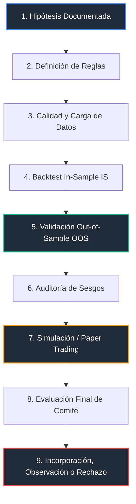

# 🛡️ Marco de Validación de Estrategias y Bots (Strategy Validation Framework)
### Rol: Director Técnico (CTO) y Arquitecto Principal del Proyecto Antigravity
### Estado: Vigente · Versión: 2.0 (Académica Ampliada)
### Restricción: PROHIBIDA LA EJECUCIÓN REAL EN MERCADOS FINANCIEROS

> [!IMPORTANT]
> **Filosofía del Ecosistema Antigravity**:
> En Antigravity, no operamos con "cajas negras" ni aceptamos "curvas de equidad milagrosas" de forma ciega. El objetivo de este proyecto no es construir un bot aislado, sino consolidar un **ecosistema integral de trading asistido por IA** capaz de validar, auditar y ejecutar en demo cualquier bot MQL5, Pinescript, señal de TradingView o modelo predictivo Python bajo un marco común determinista y seguro.
>
> Este sistema prioriza el **control de riesgo estricto, la trazabilidad, los datos limpios y la ausencia absoluta de sesgos** por encima de cualquier retorno o beneficio bruto flotante hipotético.

---

## 1. Propósito del Marco de Validación

El propósito de este marco es regular y estructurar el proceso técnico mediante el cual una estrategia o bot de trading es aceptado, supervisado o rechazado antes de integrarse al flujo operativo de Antigravity. 

El framework sirve de filtro universal para:
* **Bots MQL5 Existentes**: Sistemas automatizados heredados o comerciales en MetaTrader 5.
* **Futuras Estrategias MQL5**: Nuevos desarrollos que sigan las pautas de este framework.
* **Señales de TradingView**: Transmisiones entrantes por Webhooks y enrutadas a través del Gatekeeper.
* **Estrategias Asistidas por IA**: Algoritmos de aprendizaje automático u optimizadores que sugieran lógicas cualitativas.
* **Estrategias Manuales**: Conjuntos de reglas discrecionales codificadas de manera determinista.

---

## 2. Principios Obligatorios

Cualquier propuesta de estrategia debe respetar y someterse a los siguientes **10 Principios Inquebrantables**:

1. **Datos Buenos antes que Resultados Atractivos**: Un backtest con un profit factor irreal sobre datos de baja calidad es rechazado de inmediato. La calidad de los datos de entrada es el primer filtro.
2. **Separación Estricta In-Sample (IS) / Out-of-Sample (OOS)**: División obligatoria del historial histórico en bloques cerrados.
3. **No Contaminar el Out-of-Sample**: El segmento OOS actúa como examen ciego final. Si se reoptimiza o ajusta el código tras ver resultados en OOS, ese periodo queda contaminado e invalidado.
4. **Priorizar la Pérdida Máxima, Drawdown y Riesgo sobre el Beneficio**: Se evalúa el peor escenario posible (worst-case scenario) antes que el rendimiento teórico ideal.
5. **El Win Rate NO es una Métrica Principal**: Un alto porcentaje de aciertos puede esconder una asimetría de riesgo negativa catastrófica. Se evalúa el rendimiento ajustado al riesgo.
6. **No Aceptar Backtests con Pocas Operaciones**: Exclusión de estrategias basadas en escaso volumen transaccional que puedan explicarse por pura aleatoriedad o suerte.
7. **Penalizar Overfitting (Sobreajuste) y Data Snooping**: Descarte automático de estrategias hiper-optimizadas para un periodo concreto sin base o ineficiencia de mercado lógica fundamental.
8. **Costes de Ejecución Realistas**: Es obligatorio incluir costes de spread (fijo o dinámico), comisiones de corretaje y slippage simulado en todo backtest.
9. **Evitación Activa de Sesgos**: El bot debe estar completamente limpio de look-ahead bias, survivorship bias, sesgos de optimización y sesgos de selección.
10. **Sin Documentación, Métricas, Logs y Validación no hay Integración**: Ningún bot se conecta al pipeline operativo de Antigravity sin su ficha de manifiesto y validaciones previas de forma satisfactoria.

---

## 3. Fases de Validación

La admisión operativa de cualquier estrategia o bot sigue una secuencia lineal de **9 fases obligatorias**:



### Detalle de las Fases:
* **Fase 1: Documentación de la Hipótesis**: Redacción cualitativa que explique qué ventaja estadística o anomalía de precio explota el bot (ej. reversión de rango en sesión asiática).
* **Fase 2: Definición de Reglas**: Traducción de la hipótesis a reglas matemáticas deterministas de entrada, salida, stop loss, take profit y dimensionamiento.
* **Fase 3: Calidad de Datos**: Descarga e importación del historial de datos históricos conforme a los requerimientos de la Sección 4.
* **Fase 4: Backtest In-Sample (IS)**: Desarrollo y optimización paramétrica sobre el primer segmento histórico reservado.
* **Fase 5: Validación Out-of-Sample (OOS)**: Examen ciego sobre los datos "no vistos". Se ejecuta una única simulación directa sin alterar ningún parámetro.
* **Fase 6: Revisión de Sesgos**: Auditoría lógica del código para garantizar que no contiene variables anticipadas o costes irreales.
* **Fase 7: Simulación / Paper Trading**: Despliegue en tiempo real en cuenta Demo de MetaTrader 5 durante un periodo de control para comprobar spreads dinámicos y deslizamientos.
* **Fase 8: Evaluación Final**: Verificación cuantitativa de las métricas históricas y reales frente a los umbrales mínimos establecidos.
* **Fase 9: Incorporación, Observación o Rechazo**: Asignación de estado final e integración al catálogo del Ecosistema.

---

## 4. Reglas de Datos (Data Integrity)

La fiabilidad de los resultados depende directamente de la consistencia y veracidad del histórico utilizado:
* **Preferencia de Ticks Reales**: Para estrategias de alta frecuencia, intradía, grids y scalping rápido, es **estrictamente obligatorio** utilizar datos de ticks reales con precisión del 99% (e.g. Dukascopy, Darwinex o brokers consolidados).
* **Velas M1 Aceptables**: Las velas de un minuto (M1) se admiten únicamente para estrategias swing de mediano/largo plazo, o aquellas basadas estrictamente en precios de cierre de velas macro.
* **Evitar Datos de Broker Demo**: Se prohíbe taxativamente usar el historial genérico descargado de brokers demo genéricos para la validación final, dado que suelen carecer de precisión de ticks y sufren de severas lagunas (gaps) de datos.
* **Registro de Metadatos Obligatorio**: Cada backtest debe documentar de forma inmutable:
  * **Fuente del proveedor de datos** (Darwinex, HistData, etc.).
  * **Periodo histórico exacto** (fechas de inicio y fin).
  * **Zona horaria** del origen de datos.
  * **Costes transaccionales explícitos**: El spread dinámico o fijo medio, la comisión fija por lote y los costes de Swap nocturno del activo en el periodo simulado.

---

## 5. Separación Estricta In-Sample (IS) vs Out-of-Sample (OOS)

Para mitigar los efectos de la sobreoptimización destructiva (*Curve Fitting*), el dataset histórico se dividirá en dos bloques herméticos:

```
◄────────────────── PERIODO DE HISTÓRICO TOTAL ──────────────────►
┌──────────────────────────────────────┬────────────────────────┐
│        IN-SAMPLE (IS)                │  OUT-OF-SAMPLE (OOS)   │
│   (Desarrollo, Ajuste y Optimización)│   (Examen Final Único)  │
│               70% - 80%              │        20% - 30%       │
└──────────────────────────────────────┴────────────────────────┘
```

* **In-Sample (IS)**: Espacio temporal en el cual el desarrollador programa el sistema y optimiza parámetros del bot (e.g., ajuste de periodos de medias móviles o filtros de volatilidad).
* **Out-of-Sample (OOS)**: Conjunto de datos ciegos. Actúa como el primer contacto simulado en vivo. **No se permite reoptimizar parámetros tras ver su resultado en OOS.**
* **Contaminación**: Si los resultados de OOS no son satisfactorios, el bot es rechazado o rediseñado desde la Fase 1. Modificar parámetros basándose en los resultados OOS para intentar "corregir" la curva invalida de inmediato el proceso por contaminación de datos.
* **Propuesta Temporal Recomendada**:
  * **Periodo In-Sample**: Del 1 de enero de 2018 al 31 de diciembre de 2023.
  * **Periodo Out-of-Sample**: Del 1 de enero de 2024 al 31 de mayo de 2026.

---

## 6. Métricas Prioritarias

> [!WARNING]
> En este proyecto académico, **el Win Rate (Tasa de Aciertos) NO es una métrica de selección principal**. Un bot con un Win Rate del 90% puede quebrar una cuenta si el 10% restante genera pérdidas catastróficas por no usar Stop Loss técnico o por emplear martingalas insostenibles.

El framework de evaluación ponderará de manera prioritaria las siguientes métricas:
1. **Max Drawdown (MDD)**: Caída máxima de la equidad medida desde el pico más alto. Representa el peor escenario acumulativo temporal.
2. **Profit Factor (PF)**: Relación entre el beneficio bruto y la pérdida bruta acumulada.
3. **Recovery Factor (RF)**: Ratio entre el beneficio neto total y el Drawdown máximo absoluto. Evalúa la resiliencia del capital.
4. **Sharpe Ratio**: Retorno medio del sistema ajustado a la volatilidad histórica de la equidad (anualizado).
5. **Sortino Ratio**: Retorno medio ajustado únicamente por la volatilidad perjudicial (desviación a la baja de retornos negativos).
6. **Número de Operaciones**: Volumen transaccional suficiente para garantizar significancia y validez estadística.
7. **Ratio Beneficio/Riesgo Medio**: Relación entre el beneficio medio de las operaciones ganadoras y la pérdida media de las perdedoras.
8. **Rachas de Pérdidas**: El número máximo de operaciones perdedoras consecutivas observado en la serie.
9. **Exposición Simultánea**: Número máximo de posiciones correlacionadas y lotes concurrentes en mercado.
10. **Pérdida Diaria Máxima (Simulada)**: El peor desplome de equidad sufrido en un intervalo cerrado de 24 horas.
11. **Riesgo de Ruina**: Probabilidad matemática de liquidar o perder un porcentaje crítico de la cuenta basándose en simulaciones de Monte Carlo.

---

## 7. Umbrales Iniciales Orientativos

Toda estrategia propuesta para ingresar al catálogo del Core y conectarse a pruebas demo de Antigravity debe satisfacer los siguientes filtros cuantitativos de tolerancia (sujetos a reajuste según tipo de activo, temporalidad y perfil de la estrategia):

* **Profit Factor (PF) Mínimo**:
  * En periodo In-Sample (IS): **$\ge 1.40$**
  * En periodo Out-of-Sample (OOS): **$\ge 1.25$**
* **Max Drawdown (MDD) Máximo**: **$\le 12\%$** de la equidad.
* **Recovery Factor (RF) Mínimo**: **$\ge 3.0$** (el beneficio neto debe triplicar al menos el Drawdown acumulado).
* **Sharpe Ratio Mínimo**: **$\ge 1.20$** (anualizado).
* **Sortino Ratio Mínimo**: **$\ge 1.50$** (anualizado).
* **Número Mínimo de Operaciones**: **$\ge 150$ transacciones** en el periodo total evaluado.
* **Pérdida Máxima Diaria Proyectada**: **$\le 2.0\%$** del capital total.
* **Exposición Simultánea de Riesgo**: **$\le 3\%$** de riesgo agregado total de la cuenta en operaciones concurrentes simultáneas.

---

## 8. Sesgos Técnicos a Auditar

El código fuente del bot y el simulador de backtest deben ser minuciosamente auditados para descartar:
* **Look-Ahead Bias**: Lógica del código que consulta información que cronológicamente aún no ha ocurrido (e.g. evaluar datos que ocurren horas después de la entrada teórica).
* **Survivorship Bias**: Evaluar la rentabilidad en activos actuales ignorando aquellos que desaparecieron o cotizaban en quiebra en el histórico.
* **Data Snooping**: Descubrimiento aleatorio de parámetros que funcionaron en el pasado por pura casualidad estadística sin coherencia lógica fundamental.
* **Overfitting / Curve Fitting**: Sobreajuste extremo de los parámetros a los ruidos del histórico IS que provoca pérdidas abruptas en el OOS.
* **Sesgo de Selección de Activos**: Presentar y justificar el bot únicamente con el activo que mejor resultado dio, ocultando datos de activos similares.
* **Sesgo de Periodo Histórico**: Limitar la validación del bot a un régimen específico del mercado (e.g. optimizar únicamente en mercados alcistas o de bajísima volatilidad).
* **Costes Transaccionales Irreales**: Backtesting que asume spread constante de cero, sin slippage ni comisiones reales del broker.
* **Ejecución Imposible**: Estrategias intradía de microsegundos que presumen de ejecuciones instantáneas no replicables debido a latencias normales de API.
* **Optimización Excesiva de Parámetros**: Sistemas con más de 4 o 5 parámetros optimizados concurrentemente, lo cual eleva exponencialmente el riesgo de sobreajuste.

---

## 9. Régimen de Mercado (Market Regime Validation)

Toda estrategia robusta debe demostrar que sus métricas sobreviven y se adaptan a diferentes condiciones estructurales de mercado. El bot debe validarse sistemáticamente en:

1. **Tendencia (Trending)**: Mercados con direccionalidad definida al alza o a la baja.
2. **Rango / Consolidación (Mean Reverting)**: Zonas de acumulación lateral con ausencia de tendencia macro.
3. **Volatilidad Alta**: Periodos de gran oscilación de precios (e.g. épocas de elecciones, crisis de tipos de interés o noticias de alto impacto).
4. **Volatilidad Baja**: Zonas de compresión de rango y contracción de volumen.
5. **Sesiones Distintas**: Evaluar si el bot funciona o colapsa al cambiar de franja horaria (sesión asiática vs apertura de Nueva York).
6. **Activos Distintos**: Probar la lógica en activos de diferente correlación y comportamiento (e.g., correlación inversa Forex vs Índices).

> [!NOTE]
> **Filtros de Régimen Futuros**:
> En fases futuras, no se descarta la implementación de filtros dinámicos basados en **Modelos Ocultos de Markov (HMM)** para segmentar las condiciones de mercado de forma matemática. Por el momento, el bot debe emplear y ser validado con indicadores deterministas convencionales tales como **ATR** (volatilidad), **ADX** (fuerza de la tendencia), **Slope de medias móviles** (inclinación) o bandas estándar de desviación.

---

## 10. Detección de Degradación de Estrategias (Strategy Decay)

Una estrategia no es estática; las condiciones y el microestructura del mercado cambian de forma constante, lo que provoca la degradación del sistema. La estrategia pasará automáticamente a estado `OBSERVATION` para auditoría si se detecta alguno de los siguientes indicadores de Strategy Decay:

* **Caída del Profit Factor (PF)**: Degradación del PF por debajo de **$1.15$** durante el periodo de monitoreo activo en simulación.
* **Aumento del Drawdown**: El Drawdown real en la cuenta demo supera en un **20%** al peor Drawdown histórico estimado en el backtest.
* **Empeoramiento del Recovery Factor**: Relación beneficio/drawdown que se aplana por debajo de los umbrales esperados.
* **Ruptura de Distribución de Pérdidas**: Las operaciones perdedoras consecutivas superan el máximo registrado en la simulación histórica.
* **Desviación de Distribución Histórica**: Desviación estadística (e.g., mediante tests de hipótesis) donde la distribución de retornos actual diverge drásticamente del comportamiento paramétrico del backtest.
* **Paper Trading Inconsistente**: El rendimiento de simulación real en vivo difiere negativamente del backtest In-Sample/Out-of-Sample durante un bloque evaluativo de 30 días.

---

## 11. Versionado de Estrategias

Cualquier sistema algorítmico o manual integrado a Antigravity debe contar con un control de versiones inmutable para asegurar la reproducibilidad y trazabilidad en los logs de auditoría:

Cada ficha debe contener de manera explícita:
* **`strategy_id`**: Identificador único global (e.g., `ST-VORTEX-01`).
* **Nombre de la Estrategia**: Denominación descriptiva de la lógica.
* **Versión**: Formato semántico standard `X.Y.Z` (e.g., `1.2.0`).
* **Hash / Firma de Configuración**: Hash SHA256 o firma digital de la configuración exacta de parámetros, asegurando la integridad del bot.
* **Fecha**: Fecha de creación o modificación del bot.
* **Autor / Fuente**: Identidad del programador o sistema generador de la estrategia.
* **Parámetros Principales**: Lista descriptiva y estricta de variables de entrada.
* **Changelog**: Historial detallado de modificaciones y correcciones.

> [!WARNING]
> Cualquier cambio en las reglas de entrada/salida, modificación de parámetros numéricos clave, variación de Stop Loss/Take Profit, horarios de operación o alteración de filtros de régimen **se considerará una nueva versión obligatoria** del bot, requiriendo un reinicio en el ciclo de validación de este framework.

---

## 12. Separación Research vs Production

Para mantener la pulcritud operativa y evitar la fuga de experimentos al sistema en vivo, definimos tres estados y directorios conceptuales e inmutables:

1. **`research/`**:
   * Directorio y estado reservado para el diseño conceptual, backtests iniciales, scripts de prueba rápidos y experimentos de optimización.
   * **Bajo ninguna circunstancia** los archivos del directorio research tienen permitido enviar lógicas de transacción o interactuar de forma automatizada con el Core en cuentas reales o demo autorizadas.
2. **`production_candidate/`**:
   * Estado y directorio para aquellos bots que han culminado satisfactoriamente las fases 1 a 6 de este framework.
   * Son bots listos para simulación real activa y paper trading. Poseen identificadores y tokens de prueba temporales.
3. **`validated/`**:
   * Estrategias e infraestructuras de bots que han aprobado íntegramente las fases 7 y 8.
   * Cuentan con un estado `APPROVED_FOR_DEMO` y están plenamente integrados en el catálogo central de operación del Core en cuentas Demo MetaTrader 5 supervisadas.

---

## 13. Clasificación Oficial de Estrategias

El Ecosistema central asigna a cada bot uno de los siguientes estados inmutables en base de datos:

* **`REJECTED` (Rechazada)**: No cumple los umbrales mínimos iniciales, presenta sesgos detectados o muestra una degradación severa irreversible. Desconectada y bloqueada permanentemente.
* **`OBSERVATION` (En Observación)**: Estrategias en evaluación de degradación, rediseño técnico menor o en espera de recabar mayor volumen de transacciones reales.
* **`PAPER_TRADING_READY` (Lista para Simulación)**: Aprobada en backtest teórico IS/OOS y libre de sesgos. Autorizada exclusivamente para el entorno de simulación local.
* **`APPROVED_FOR_DEMO` (Aprobada para Demo)**: Estrategia validada y autorizada para el enrutamiento de señales en cuentas **Demo de MetaTrader 5**, bajo la mediación estricta de la Capa de Aprobación.
* **`BLOCKED_FOR_REAL` (Bloqueada para Real)**: **Bloqueo y candado de seguridad absoluto por diseño académico.** Ninguna estrategia está autorizada para emitir ejecuciones a cuentas de corretaje reales.

---

## 14. Relación con el Ecosistema Completo (BOT + IA + ECOSISTEMA)

El marco de validación actúa como el plano lógico regulador del Core:

* **RiskEngine**:
  * Utilizará la base de datos para mapear el ID y versión de la estrategia asociada al `TradeIntent`.
  * Rechazará al instante mediante la regla **R8_INVALID_STRATEGY** cualquier intent que no proceda de un ID registrado en estado `APPROVED_FOR_DEMO`.
  * Monitoreará y limitará la exposición del drawdown agregado real del bot según los límites de la Sección 7.
* **AI Validator**:
  * Evaluará semánticamente si el rationale técnico del trade emitido por el bot es congruente con la hipótesis teórica inicial parametrizada en la ficha técnica del bot.
* **Gatekeeper / n8n / TradingView**:
  * Las señales entrantes vía webhooks se validarán contra la firma hash de la versión de la estrategia registrada para evitar la inyección de señales maliciosas o desactualizadas.
* **Telegram (Approval Layer)**:
  * El bot informará mediante mensajes enriquecidos en Telegram las alertas de degradación (*Strategy Decay*) o desviaciones críticas de equidad.
* **MetaTrader 5 (MT5)**:
  * Los asesores expertos (EAs) en MQL5 deberán enviar obligatoriamente su `strategy_id` y `version` en el header o metadatos de toda orden enviada a la API de Antigravity.

---

## 15. Plantilla de Ficha de Estrategia (Strategy Manifest)

Toda estrategia candidata debe registrar y completar esta plantilla antes de ser evaluada:

```markdown
# 📋 Manifiesto de Estrategia: [Nombre de la Estrategia]

## 1. Identificación y Metadatos
* **ID Único de Estrategia (`strategy_id`)**: `ST-XXXX-YY`
* **Versión del Bot**: `1.0.0`
* **Nombre Comercial**: `[Escribe aquí]`
* **Autor / Programador**: `[Nombre / IA]`
* **Fecha de Registro**: `YYYY-MM-DD`
* **Configuración Hash (SHA256)**: `[Pegar Hash del archivo config o MQL5]`
* **Clasificación Inicial Propuesta**: `RESEARCH | PRODUCTION_CANDIDATE`

## 2. Hipótesis Teórica e Ineficiencia de Mercado
* **Clase de Activo**: `FOREX | CRIPTOMONEDAS | ÍNDICES`
* **Activos Objetivo**: `[e.g., EURUSD, SP500]`
* **Timeframe de Análisis**: `[e.g., H1]`
* **Descripción de la Hipótesis**: `[Describe la lógica subyacente y por qué debería generar retorno persistente]`
* **Régimen de Mercado Destinado**: `[Tendencia alcista / bajista / lateral / volatilidad]`

## 3. Especificación Técnica de Reglas
* **Reglas de Entrada (Compra / Venta)**:
  * 1. `[Regla exacta 1]`
  * 2. `[Regla exacta 2]`
* **Reglas de Salida**:
  * **Stop Loss Técnico**: `[e.g., 1.5 * ATR (14) debajo de entrada]`
  * **Take Profit Técnico**: `[e.g., 2.0 * R/R]`
  * **Salida de Emergencia**: `[e.g., Cierre por fin de sesión o noticias]`
* **Dimensionamiento de Posición**: `[e.g., Lotaje fijo 0.01 o 1.0% de equidad]`

## 4. Auditoría de Calidad de Datos
* **Proveedor de Histórico**: `[e.g., Darwinex tickdata]`
* **Precisión y Tipo**: `[Ticks reales / Velas M1 al 99%]`
* **Rango Temporal**: `YYYY-MM-DD a YYYY-MM-DD`
* **Zona Horaria del Dataset**: `[e.g., UTC / GMT+2]`
* **Costes Simulados**:
  * **Spread**: `[e.g., Dinámico, promedio 0.8 pips]`
  * **Comisión por Lote**: `[e.g., 5.0 USD por lote de ida y vuelta]`
  * **Slippage Simulado**: `[e.g., 1.0 pips de penalización en toda orden]`

## 5. Reporte de Métricas Obtenidas
* **Periodo In-Sample (IS)**: `YYYY-MM-DD a YYYY-MM-DD`
* **Periodo Out-of-Sample (OOS)**: `YYYY-MM-DD a YYYY-MM-DD`

| Métrica | In-Sample (IS) | Out-of-Sample (OOS) | Cumple Umbral? (SÍ/NO) |
|---|---|---|---|
| **Número Total de Trades** | | | |
| **Profit Factor (PF)** | | | |
| **Max Drawdown (MDD) %** | | | |
| **Recovery Factor (RF)** | | | |
| **Sharpe Ratio** | | | |
| **Sortino Ratio** | | | |
| **Pérdida Diaria Máxima %** | | | |
| **Racha de Pérdidas Máx** | | | |
| **Riesgo de Ruina (Monte Carlo)**| | | |

## 6. Lista de Verificación de Sesgos (Autoevaluación)
- [ ] **Look-Ahead Bias**: Verificado que el código no consulta datos del futuro.
- [ ] **Survivorship Bias**: Verificado que los activos no sufren de sesgo de supervivencia en el periodo de backtest.
- [ ] **Overfitting / Curve Fitting**: Comprobado que la diferencia de PF entre IS y OOS es menor al 20%.
- [ ] **Costes Reales**: Spread, swap y slippage aplicados explícitamente en el simulador.
- [ ] **Ejecución Realista**: Los trades duran lo suficiente para no depender de microsegundos de latencia.

## 7. Dictamen y Firma del Arquitecto
* **Decisión Final**: `REJECTED | OBSERVATION | PAPER_TRADING_READY`
* **Notas del Arquitecto**: `[Escribe notas y recomendaciones de robustez]`
```

---

## 16. Siguiente Paso Recomendado (Roadmap)

Se propone como la siguiente tarea técnica prioritaria el diseño de la especificación técnica de las métricas matemáticas precisas:
* **Archivo Recomendado**: `docs/trading_rules/METRICS_STANDARD.md`
* **Objetivo**: Desarrollar en ese documento las ecuaciones, algoritmos y fórmulas analíticas precisas de cada una de las métricas (Sharpe, Sortino, drawdown exacto, distribución de pérdidas) para que puedan ser implementadas en Python de manera homogénea en las fases de desarrollo.

---
*Diseño y Especificación Técnica bajo la autoría del Director Técnico y Arquitecto Principal del Proyecto Antigravity.*
